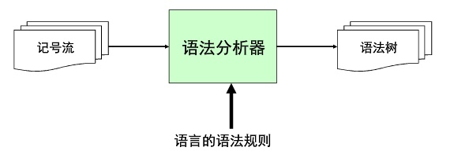

```json
{
  "date": "2020.09.09 22:00",
  "tags": ["编译原理","笔记","语法分析"],
  "musicId":"1376873330",
  "description":"如果说词法分析（Lexical Analysis）是将一段字符串输入生成一个个Token的这么一个过程，那么语法分析（Syntax analysis）就是根据某种特定的形式文法（Grammar）对 Token 序列构成的输入文本进行分析并确定其语法结构的一种过程，也可以理解为依据语法规则，把 Token 串转化成 AST的过程，核心知识点就是要会书写语法规则和掌握上下文无关文法以及递归下降算法，语法分析的过程会使用自顶向下或者自底向上的方式进行。👏"
}
```


> 先来一首网抑云防止抑郁。


# 上下文无关文法（context-free grammar, CFG）

上下文无关文法是描述程序语言语法的强有力的数学工具，可以理解为我们使用上下文无关文法来描述语法规则，在《编译原理粗浅学习笔记一预备知识》篇有简单介绍有关和无关文法，在上一篇也出现了正则文法，说实话，刚开始接触这些的时候一头雾水，只有不停的查资料，那么还有其他文法吗？？


## 其他文法

- 3型文法：正则文法：词法结构
- 2型文法：上下文无关文法：语法结构
- 1型文法：上下文有关文法
- 0型文法：任意文法

为什么要用上下文无关文法来描述语法规则呢？

我们书写的程序其实就是一句一句的句子，由这些句子构成了一个程序（句子的集合），那么我们要如何去准确的描述这些集合的规则呢？比如程序里面的一个子句变量声明
```
int a = 2
```
该如何用规则来描述？？可以用正则文法吗？？ 其实正则文法属于3型文法，是无法做到准确描述各种规则的语法结构的，正则文法也只是上下文无关文法里面的一个子集，
也叫做**线性文法（Linear Grammar）**，这里我们就要先来学习一下上下文无关文法之后 在来说说它和线性文法（正则文法）的区别。


上下文无关文法 CFG是一个四元组(N,Σ,P,S) ，下面我们看一下CFG的组成：

- N 有限个非终结符的集合；
- Σ 有限个终结符的集合；
- P 有限个生产规则12的集合；
- S 非终结符集合中唯一的开始符号