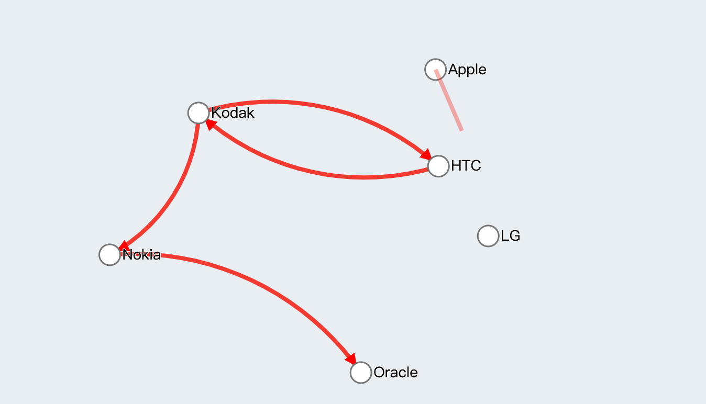
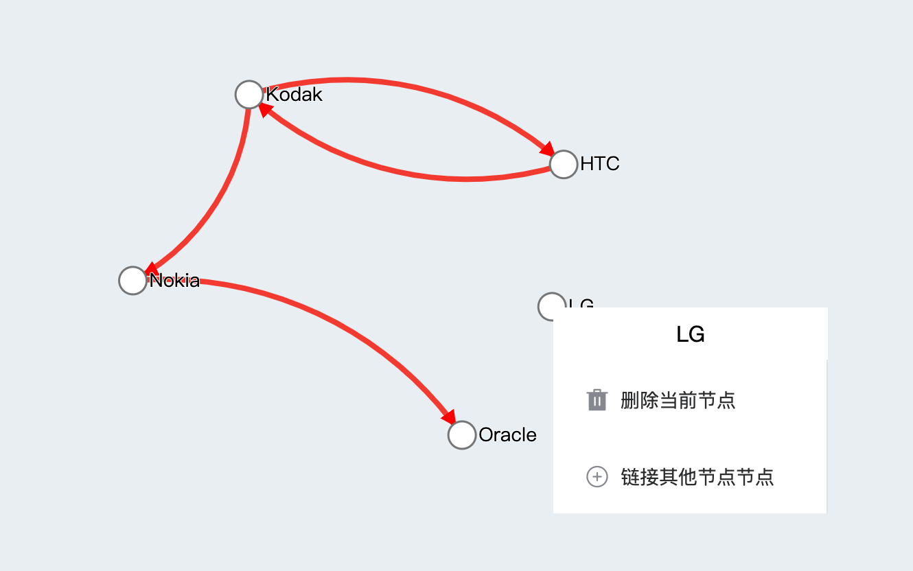

```json
{
  "date": "2020.11.15 15:00",
  "tags": ["D3","关系图"]
}
```


一提到前端可视化这个词，可能给我们的印象就是使用 百度的echarts、阿里的g2、g6和一些charts、d3等js库画画图表，调用api之类的，直到最近工作需求简单的去了解了可视化之后才发现并不是我们想的这么简单，可视化是可以独立一个分支出来的，我们工作中也只是常常停留在工具的使用层面而已，真正的可视化在视觉方面分为工具、图形库、图形系统、理论基础。在数据方面也有 设计语言、数据建模、数据分析等，遇到大数据还需要考虑性能方面的优化。不过这里我只是工作需要简单的理一下使用d3实现一个力导向的关系图，如果哪天想往这个方面发展在说吧。


> 注意：这篇文章只是记录我在做力导向图的主要思路，不涉及更多的细节，因此对你可能不太友好，代码也不太完整。如果你也遇到这样的问题可以留言，我会给出完整的代码。

## 为什么选择D3而不是使用像阿里G6这样的图表库

我一直不太喜欢使用d3，倒不是说它不好，而是它需要关注大量的细节才能做到echarts和G6简单配置数据的工作，因此，一开始我也是选择G6来实现的，我自定义了它的节点，也花了好多时间去查配置，最后也是简简单单拼出来我想要的功能，但是非常蹩脚，节点之间的连线非常不友好，明明已经设置了节点的连接点 anchorPoint ，但是所有线条不怎么听使唤是的，因为是canvas画出来的，交互性并没有那么好，比如鼠标就不能选择节点的文字，因为对于他来说就是一张图，因此我想用d3试试。


## 前端图形系统

- HTML/CSS
- SVG
- Canvas
- WebGl

是的，HTML和CSS也能拿来做可视化，柱状图也可以是一个DIV+CSS画出来的。不过我们选择使用比较多的是SVG和Canvas，SVG具有更好的交互性，因为图表里的任何一个点都是一个真实的dom元素，你可以用CSS来改变它们的外观，像操作浏览器其他文字一样复制文字等，但是在数据量大的时候SVG表现就没有Canvas好了。像echarts使用canvas来画图，虽然功能强大，配置复杂，但是在样式细节控制上仍然没有Css那么灵活。

## D3.js - 数据驱动文档

现在最新的D3是6.2。已经完全使用新语法重构了，还做了模块的细分，比如今天我们就会使用到它的d3-drag、d3-selection、d3-force等模块，按需引入真香，它们分别是拖拽、选择和力导向模块。d3-selection是帮我们操作dom用的，用来画svg。先看看我们今天要做什么？如下图。







### 确定数据

```javascript
dataEdges:[
  {source: "1", target: "2"},
  {source: "1", target: "3"},
  {source: "2", target: "4"},
  {source: "1", target: "4"},
  {source: "5", target: "6"},
  {source: "5", target: "1"},
  {source: "4", target: "1"}
],
dataNodes:[
  {id: "1", name: "Microsoft"},
  {id: "2", name: "Nokia"},
  {id: "3", name: "HTC"},
  {id: "4", name: "Oracle"},
  {id: "5", name: "Apple"},
  {id: "6", name: "LG"},
  {id: "7", name: "Kodak"}
]
```

### 画图

我们使用d3-selection先将我们的节点文字和连线画出来。

准备svg和我们的右键出来的菜单。

```html
<svg id="main-svg"></svg>
<div
     class="contextmenu"
     v-if="contextmenu.show"
     :style="` top: ${contextmenu.y}px; left: ${contextmenu.x}px`"
     >
  <div style="text-align: center;padding: 10px">
    {{ contextmenu.node.name }}
  </div>
  <el-menu>
    <el-menu-item index="2" @click.native="deleteNode()">
      <i class="el-icon-delete-solid"></i>
      <span slot="title">删除当前节点</span>
    </el-menu-item>
    <el-menu-item index="1" @click.native="startLink()">
      <i class="el-icon-circle-plus-outline"></i>
      <span slot="title">链接其他节点节点</span>
    </el-menu-item>
  </el-menu>
</div>
```


```javascript

this.mainSvg = select("#main-svg");
  
addArrow(){
  this.mainSvg
    .append("defs")
    .append("marker")
    .attr("id", "Arrow")
    .attr("class", "arrow")
    .attr("viewBox", "0 -5 10 10")
    .attr("refX", 16)
    .attr("refY", 0)
    .attr("markerWidth", 3)
    .attr("markerHeight", 3)
    .attr("orient", "auto")
    .append("path")
    .style("fill", "#f00")
    .attr("d", "M0,-5L10,0L0,5")
},
  addEdges(){
    this.mainSvg
      .insert("g",'g')//不要用append,因为会覆盖节点
      .attr("id", "edges")
      .selectAll("path")
      .data(this.dataEdges)
      .enter()
      .append("path")
      .attr("class", "edge")
      .attr("marker-end", "url(#Arrow)")
      .on("click", (e,d)=>{
      this.dataEdges.splice(d.index, 1);
      this.updateEdges()
    });
  },
    addNodes(){
      this.mainSvg
        .append("g")
        .attr("id", "nodes")
        .selectAll("circle")
        .data(this.dataNodes)
        .enter()
        .append("circle")
        .attr("class", "node")
        .attr("r", 10)
        .style("cursor", "pointer")
        .call(this.dragFixedNode())
        .on("contextmenu", this.clickContextmenu)
        .on("click", (e, d) => {

        if (!this.link.is) {
          //如果不是连线模式
          return;
        }
        //是连线模式
        this.clearLink();
        let s = this.contextmenu.node;
        this.dataEdges.push({source: s.id, target: d.id});

        this.updateEdges()
      });

      this.mainSvg
        .append("g")
        .attr("id", "nodeText")
        .selectAll("text")
        .data(this.dataNodes)
        .enter()
        .append("text")
        .attr("x", 12)
        .attr("class", "text")
        .attr("y", ".31em")
        .text(d => d.name);
    },
```

上面三个函数分别是画箭头边线以及节点和节点文字，箭头被定义在svg的defs节点，然后你会发现节点和文本并没有设置坐标，后续会通过d3的力导向设置transform属性来定位，边的（d属性）路径也没有设置，也需要d3-force来做， 如果不太了解svg可能需要去查阅相关资料。这里我们还添加了节点的点击事件和拖拽等功能

来看看生出的dom

```html
<svg id="main-svg">
  <g id="edges">
    <path class="edge" marker-end="url(#Arrow)"></path>
    <path class="edge" marker-end="url(#Arrow)"></path>
    <path class="edge" marker-end="url(#Arrow)"></path>
    <path class="edge" marker-end="url(#Arrow)"></path>
    <path class="edge" marker-end="url(#Arrow)"></path>
    <path class="edge" marker-end="url(#Arrow)"></path>
    <path class="edge" marker-end="url(#Arrow)"></path>
  </g>
  <g id="nodes">
    <circle class="node" r="10" style="cursor: pointer;"></circle>
    <circle class="node" r="10" style="cursor: pointer;"></circle>
    <circle class="node" r="10" style="cursor: pointer;"></circle>
    <circle class="node" r="10" style="cursor: pointer;"></circle>
    <circle class="node" r="10" style="cursor: pointer;"></circle>
    <circle class="node" r="10" style="cursor: pointer;"></circle>
    <circle class="node" r="10" style="cursor: pointer;"></circle>
  </g>
  <g id="nodeText">
    <text x="12" class="text" y=".31em">Microsoft</text>
    <text x="12" class="text" y=".31em">Nokia</text>
    <text x="12" class="text" y=".31em">HTC</text>
    <text x="12" class="text" y=".31em">Oracle</text>
    <text x="12" class="text" y=".31em">Apple</text>
    <text x="12" class="text" y=".31em">LG</text>
    <text x="12" class="text" y=".31em">Kodak</text>
  </g>
  <defs>
    <marker id="Arrow" class="arrow" viewBox="0 -5 10 10" refX="16" refY="0" markerWidth="3"
            markerHeight="3" orient="auto">
      <path d="M0,-5L10,0L0,5" style="fill: rgb(255, 0, 0);"></path>
    </marker>
  </defs>
</svg>
```

然后添加一些CSS样式

```scss
#main-svg {
            width: 100%;
            height: 100%;
        }

.ligature {
  fill: none;
  stroke: #f44336;
  stroke-width: 2;
  cursor: pointer;
}

.link,
.edge {
  fill: none;
  stroke: #f44336;
  stroke-width: 4;
  cursor: url("data:image/png;base64,iVBORw0KGgoAAAANSUhEUgAAABAAAAAQCAYAAAAf8/9hAAABqElEQVQ4T6WTPWhUQRSFz3mP1W0sBBFivc06M6UWNoqlhYoQgilCmnQKBixi5aYQhK0Mlv6BhRDhBTEEU2kppHJmnmznYmlAC7eweMyRt7xAXH9Y2anmDvd+99zDHWLGwxnr8V8Aa+0mgPmm6XqMsTc1wDl3Q9IayfuSTgG402q1Tk4NMMa8JPkixlhYazcA3JQ0xyZYBvABwJssy1557+OkN9batzVA0gbJXZK3vPefxgqMMaskrwM40xRuA3gSY9yqY+fceUnv6ruklbIsHx00+GUEY8wiycsAFuoEkmVK6XFKqcjz/FmWZQve+y+H1f3RA2PMRQDXSC4BONZ0PluW5d7kaL8BnHPHJRUA1kl+lrREcqVxfgdAQbIIIXwbqzxMdM4tS3ravO2R7IUQdrrd7lye5w9IdlJKX0meriFVVd07MPEIgE2SVwDsA+jHGPsT8HqBzoUQVp1zlwBclXSCzrl5SfWGfQfwvKqq/mAwGE7O2ul0jrbb7Y8k1yTtk3yYUtoeK7DWXhiNRu+Hw+GPf/0Na20PwN0m53We57en3sS/gWcG/ARU4qPUKOyVTQAAAABJRU5ErkJggg=="),
    auto;

  &:hover {
    stroke: #E6A23C;
  }
}

#licensing {
  fill: #009688;
}

#suit {
  fill: #f44336;
}

#resolved {
  fill: #1565c0;
}

.link.licensing {
  stroke: #009688;
}

.link.resolved {
  stroke: #1565c0;
  stroke-dasharray: 0, 2 1;
}

circle {
  fill: #fff;
  stroke: grey;
  stroke-width: 1.5px;
}

text {
  font: 14px sans-serif;
  pointer-events: none;
  text-shadow: 0 1px 0 #fff, 1px 0 0 #fff, 0 -1px 0 #fff, -1px 0 0 #fff;
}

.msg-title {
  font-size: 16px;
  font-weight: bold;
}
```


### 通过d3-force设置所有元素的位置

前面通过select分别画出了节点文字边和箭头的svg元素，但是都没有坐标，也就是说，它们现在的表现是一坨铺在画布上。我们来添加力。

```javascript
setForceSimulation(){
  const Svg = document.getElementById("main-svg");
  const cx = Svg.clientWidth / 2;
  const cy = Svg.clientHeight / 2;
  this.f = forceSimulation(this.dataNodes, d => d.id)
    .force("charge", forceManyBody().strength(50))
    .force("collide", forceCollide().radius(50))
    .force("center", forceCenter(cx, cy))
    .force("link", forceLink().id(r => r.id).links(this.dataEdges))
    .force("x", forceX(cx))
    .force("y", forceY(cy)).on("tick", () => {
    this.mainSvg.selectAll(".edge").attr("d", this.edgeArc);
    this.mainSvg.selectAll(".node").attr("transform", this.transform);
    this.mainSvg.selectAll(".text").attr("transform", this.transform);
  });
},
```

其中还涉及到了很多细节，比如连线拖拽更新数据等。

```javascript
edgeArc(d) {
  const dx = d.target.x - d.source.x;
  const dy = d.target.y - d.source.y;
  const dr = Math.sqrt(dx * dx + dy * dy);
  return `M${d.source.x},${d.source.y}A${dr},${dr} 0 0,1 ${d.target.x},${d.target.y}`;
},
transform (d) {return `translate(${d.x},${d.y})`;},
dragFixedNode(){
    return drag()
      .on("start", (event, d) => {
      if (!event.active) this.f.alphaTarget(0.3).restart();
      d.fx = event.x;
      d.fy = event.y;
      this.contextmenu.show = false;
    })
      .on("drag", (event, d) => {
      d.fx = event.x;
      d.fy = event.y;
    })
      .on("end", (event, d) => {
      if (!event.active) this.f.alphaTarget(0);
      d.fx = event.x;
      d.fy = event.y; //固定
    });
},
updateEdges(){
  this.mainSvg.select("#edges").remove();
  this.addEdges();
  this.f.force("link", forceLink().id(r => r.id).links(this.dataEdges));
  this.f.alpha(1).restart();
},
updateNodes(){
  this.mainSvg.select("#nodes").remove();
  this.mainSvg.select("#nodeText").remove();
  this.addNodes();
  this.f.nodes(this.dataNodes);
  this.f.alpha(1).restart();
},
deleteNode() {
                //提示
  this.contextmenu.show = false;
  let delId = this.contextmenu.node.id;
  this.dataNodes.forEach((n, i) => {
    if (n.id === delId) {
      this.dataNodes.splice(i, 1)
    }
  });
  this.updateNodes();
  let newEdges = [];
  this.dataEdges.forEach(n => {
    if (n.source.id === delId || n.target.id === delId) {
      return
    }
    newEdges.push(n)
  });
  this.dataEdges = newEdges;
  this.updateEdges()
},
clickContextmenu(e, d) {
  this.clearLink();
  d.fx = d.x;
  d.fy = d.y;
  this.contextmenu.show = true;
  this.contextmenu.y = e.y;
  this.contextmenu.x = e.x;
  this.contextmenu.node = d;
  e.preventDefault();
},
    // nodeDrag() {
    //   //开始拖动节点
    //   this.contextmenu.show = false;
    // },
startLink() {
  this.link.is = true;
  this.contextmenu.show = false;

  this.link.tempLinkDom = select("#main-svg")
    .append("path")
    .style("stroke-width", 4)
    .style("pointer-events", "none")
    .style("opacity", 0.4)
    .attr("class", "ligature");
},
mainSvgClick() {
  //点击画布
  this.contextmenu.show = false;
  this.clearLink();
},
mainSvgMousemove(e) {
  //画布移动鼠标
  if (!this.link.is) {
    //如果不是连线模式
    return;
  }
  if (this.link.tempLinkDom) {
    let {x, y} = this.contextmenu.node;
    this.link.tempLinkDom.attr(
      "d",
      `M${x},${y}L${e.offsetX},${e.offsetY}`
    );
  }
},
clearLink() {
  //清除连线
  this.link.is = false;
  if (this.link.tempLinkDom) {
    this.link.tempLinkDom.remove();
  }
}
```

每个节点的固定、摆放、弹力等细节都可以控制了，你也可以用css控制每一个文字每一条线的颜色大小，我就使用了css选择器选择了边线，鼠标移动上去出现剪刀图标用来点击剪断线条，也可以用js选择dom添加自己的事件。就是代码量变得更多了。