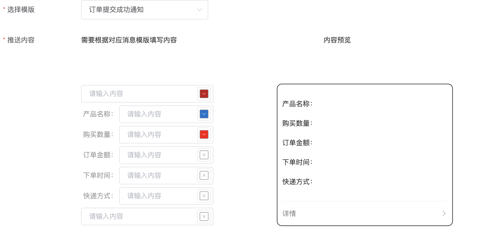

```json
{
  "date": "2022.05.05 20:00",
  "tags": ["模板语法","词法分析"],
  "description":"我们知道微信公众号可以通过提前编辑好的模板发送给用户消息，首先要获取模板语法，然后通过模板语法发送模板消息，那么就需要设置模板语法中的关键字和颜色，这个过程往往通过程序来解析发送的。如果想让这个过程交给公众号的运营人员，那么前端该怎样解析语法并呈现出对应的交互让用户填入关键字和选择颜色是一个有趣的工作。"
}
```

我们知道微信公众号可以通过提前编辑好的模板发送给用户消息，首先要获取模板语法，然后通过模板语法发送模板消息，那么就需要设置模板语法中的关键字和颜色，这个过程往往通过程序来解析发送的。如果想让这个过程交给公众号的运营人员，那么前端该怎样解析语法并呈现出对应的交互让用户填入关键字和选择颜色是一个有趣的工作。

当我们通过接口获取微信消息模板的时候会得到如下字符串：

```json
{	
     "template_list": [{
      "template_id": "iPk5sOIt5X_flOVKn5GrTFpncEYTojx6ddbt8WYoV5s",
      "title": "领取奖金提醒",
      "primary_industry": "IT科技",
      "deputy_industry": "互联网|电子商务",
      "content": "{ {result.DATA} }\n\n领奖金额:{ {withdrawMoney.DATA} }\n领奖  时间:    { {withdrawTime.DATA} }\n银行信息:{ {cardInfo.DATA} }\n到账时间:  { {arrivedTime.DATA} }\n{ {remark.DATA} }",
      "example": "您已提交领奖申请\n\n领奖金额：xxxx元\n领奖时间：2013-10-10 12:22:22\n银行信息：xx银行(尾号xxxx)\n到账时间：预计xxxxxxx\n\n预计将于xxxx到达您的银行卡"
   }]
}
```

现在我们要做的就是将content字段解析出来，将里面的关键字转化为对应的交互，既将关键字转化为input和颜色选择器，当用户填入全部关键字和选择每个关键字的颜色之后，我们需要将如下关键信息告诉后台：

```json
{
    "data":{
    "first": {
    "value":"恭喜你购买成功！",
    "color":"#173177"
  	},
  "keyword1":{
    "value":"巧克力",
    "color":"#173177"
  	},
  "keyword2": {
    "value":"39.8元",
    "color":"#173177"
  	},
  "keyword3": {
    "value":"2014年9月22日",
    "color":"#173177"
  	},
  "remark":{
    "value":"欢迎再次购买！",
    "color":"#173177"
  	}
  }
}
```

这些关键字一一对应模板语法的关键字，那我们其实就是要解析```{ {result.DATA} }\n\n领奖金额:{ {withdrawMoney.DATA} }\n领奖  时间:    { {withdrawTime.DATA} }\n银行信息:{ {cardInfo.DATA} }\n到账时间:  { {arrivedTime.DATA} }\n{ {remark.DATA} }```

遇到诸如```{ {withdrawTime.DATA} }```我们要给用户输入框和颜色选择器，遇到\n我们就要换行，当用户填入全部关键字还要能准确的连成一句通顺的话，例如：

```json
{
  content: "{{first.DATA}}\n产品名称：{{keyword1.DATA}}\n购买数量：{{keyword2.DATA}}\n订单金额：{{keyword3.DATA}}\n下单时间：{{keyword4.DATA}}\n快递方式：{{keyword5.DATA}}\n{{remark.DATA}}"
  deputyIndustry: "其他"
  example: "您的订单已提交成功\r\n产品名称：水晶手串\r\n购买数量：2\r\n订单金额：128元\r\n下单时间：2014年8月28日 16:20\r\n快递方式：货到付款\r\n感谢您的支持，如有疑问，请拨打123456789"
  primaryIndustry: "其他"
  templateId: "4Q4yIHO20CQQ6RX2VXXXYtJKh13ea8HZNsKRfLT-XXX"
  title: "订单提交成功通知"
}
```

那么我们应该转换成如下交互：



并且保证没有\n时不能换行，最大程度还原模板语法。

那么这个问题最关键的是如何解析模板语法，我们可以把语法简单的分为3部分，当然还有一些错误的token，例如：

token.js

```js
const WrapToken = "wrap", InputToken = "input", TextToken = "text", ErrToken = "err";

export {WrapToken,InputToken,TextToken,ErrToken}
```

如何按照分类的token解析就行了，然后将解析出来的token数组循环到页面上就ok了，

例如上面的订单提交通知```{{first.DATA}}\n产品名称：{{keyword1.DATA}}\n购买数量：{{keyword2.DATA}}\n订单金额：{{keyword3.DATA}}\n下单时间：{{keyword4.DATA}}\n快递方式：{{keyword5.DATA}}\n{{remark.DATA}}``` 可以解析得到如下token

```json
[
	{"type":"input","val":"first","lit":"{{first.DATA}}","index":0},	
  {"type":"wrap","val":"\n","lit":"\n","index":14},
  {"type":"text","val":"产品名称：","lit":"产品名称：","index":15},
  {"type":"input","val":"keyword1","lit":"{{keyword1.DATA}}","index":20},
  {"type":"wrap","val":"\n","lit":"\n","index":37},
  {"type":"text","val":"购买数量：","lit":"购买数量：","index":38},
  {"type":"input","val":"keyword2","lit":"{{keyword2.DATA}}","index":43},
  {"type":"wrap","val":"\n","lit":"\n","index":60},
  {"type":"text","val":"订单金额：","lit":"订单金额：","index":61},
  {"type":"input","val":"keyword3","lit":"{{keyword3.DATA}}","index":66},
  {"type":"wrap","val":"\n","lit":"\n","index":83},
  {"type":"text","val":"下单时间：","lit":"下单时间：","index":84},
  {"type":"input","val":"keyword4","lit":"{{keyword4.DATA}}","index":89},
  {"type":"wrap","val":"\n","lit":"\n","index":106},
  {"type":"text","val":"快递方式：","lit":"快递方式：","index":107},
  {"type":"input","val":"keyword5","lit":"{{keyword5.DATA}}","index":112},
  {"type":"wrap","val":"\n","lit":"\n","index":129},
  {"type":"input","val":"remark","lit":"{{remark.DATA}}","index":130}
]
```

得到这样的token就简单了，我们可以通过vue的v-for循环这个数组，遇到什么样的token就展示什么样的交互就行。

```vue
<template v-for="(t,i) in tokens">
  <div class="wrap-token" v-if="t.type === tokenType.WrapToken">
    </div>
  <div class="input-token" :class="{full:isLine(i)}" v-if="t.type === tokenType.InputToken">
  <el-input
            size="medium"
            style="width: 100%"
            placeholder="请输入内容"
            v-model="vModelText[t.val]">
    <div slot="suffix"
         style="width: 100%;height: 100%;display: flex;justify-content: center;align-items: center">
      <el-color-picker size="mini" v-model="vModelColor[t.val]"></el-color-picker>
  </div>
  </el-input>
  </div>
  <div class="text-token" v-if="t.type === tokenType.TextToken">
    {{ t.val }}
   </div>
	<div class="err-token" v-if="t.type === tokenType.ErrToken">
    <el-alert
              title="微信模版语法有误，无法解析"
              type="error">
    </el-alert>
  </div>
</template>
```

根据前面学习的词法分析思路，我们可以构造一个状态机之类的来解析，看看我的思路吧。

```js
import {WrapToken, InputToken, TextToken, ErrToken} from "./token.js"

const TemplateL = "{{", TemplateR = "}}"

export default {
    data() {
        return {
            tokenType: {WrapToken, InputToken, TextToken, ErrToken},
        }
    },
    methods: {
        tokenizer(str) {
            let token = [];

            let index = 0
            let strLen = str.length

            if (strLen === 0) {
                return token
            }
            while (index < strLen) {
                let s = str[index]
                if (index === strLen - 1) {//如果是最后一个字符，那就当文字处理
                    token.push({type: TextToken, val: s, lit: s, index})
                    return token
                }
                let surplusStr = str.substring(index);
                if (s === '\n') {
                    token.push({type: WrapToken, val: "\n", lit: "\n", index})
                    index += 1;
                    continue;
                }
                if (s === '{' && str[index + 1] === '{') {
                    let t = this.parseInputToken(surplusStr, index)

                    if (t.success) {
                        token.push(t.token)
                        index += t.len
                        continue
                    } else {
                        let t = this.parseTextToken(surplusStr, index);

                        token.push(t.token)
                        index += t.len
                        continue
                    }

                }
                let t = this.parseTextToken(surplusStr, index);

                token.push(t.token)
                index += t.len
            }
            return token;

        },
        parseInputToken(s, index) {
            let ei = s.indexOf(TemplateR);
            if (ei === -1) {
                return {
                    success: false,
                    token: {type: ErrToken, val: "", lit: "", index},
                    len: 0
                }
            }
            let lit = s.substring(0, ei + TemplateR.length)
            let val = lit.replace(TemplateL, "")
            val = val.replace(TemplateR, "")
            val = val.replace(".DATA", "")
            return {
                success: true,
                token: {type: InputToken, val: val, lit: lit, index},
                len: lit.length
            }
        },
        parseTextToken(s, index) {//只要进来这个方法，就不会有失败的token
            let WrapTokenIndex = s.indexOf("\n")
            let InputTokenIndex = s.indexOf(TemplateL)
            if (WrapTokenIndex === -1 && InputTokenIndex === -1) {
                return {
                    success: true,
                    token: {type: TextToken, val: s, lit: s, index},
                    len: s.length
                }
            } else if (WrapTokenIndex > InputTokenIndex) {//InputToken
                let lit = s.substring(0, InputTokenIndex)

                return {
                    success: true,
                    token: {type: TextToken, val: lit, lit: lit, index},
                    len: lit.length
                }
            }
            //WrapToken
            let lit = s.substring(0, WrapTokenIndex)
            return {
                success: true,
                token: {type: TextToken, val: lit, lit: lit, index},
                len: lit.length
            }
        },
        isLine(index) {//独占一行的InputToken
            if(this.tokens.length === 1){
                return true
            }
            if(index===0 && this.tokens[1].type === WrapToken){
                return true
            }
            if (index === this.tokens.length - 1 && this.tokens[index-1].type === WrapToken) {
                return true;
            }
            return false
        }
    },

}

```

这样我们通过：

```js
let tokens = this.tokenizer(str)
```

即可得到模板语法token。

最后，可能学习编译原理并不能坚持弄明白每一个细节，但是，它给我带来的思路却是很宝贵的。
