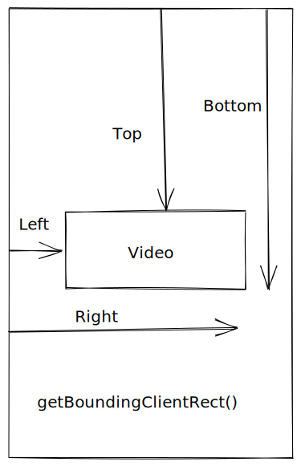

```json
{
  "date": "2020.09.29 21:00",
  "tags": ["移动端","video"],
  "description":"记录下最近工作上做的一些东西吧，我们有一个移动端页面大概有50个video视频列表，需要实现竖屏和横屏的情况下，一个正在播放的视频如果被滑动可视区域外则暂停播放。同时也列一下video标签的一些奇奇怪怪的属性，方便下次查询。"
}
```

# video 标签的一些属性
```
height="240px"  /*如果有封面，请设置高度*/
controls  /*这个属性规定浏览器为该视频提供播放控件*/
style="object-fit:fill"  /*加这个style会让 Android / web 的视频在微信里的视频全屏，如果是在手机上预览，会让视频的封面同视频一样大小*/
webkit-playsinline="true"  /*这个属性是ios 10中设置可以让视频在小窗内播放，也就是不是全屏播放*/
x-webkit-airplay="true"  /*这个属性还不知道作用*/
playsinline="true"  /*IOS微信浏览器支持小窗内播放*/
x5-video-player-type="h5" /*启用H5播放器,是wechat安卓版特性*/
x5-video-orientation="h5" /*播放器支付的方向，landscape横屏，portraint竖屏，默认值为竖屏*/
x5-video-player-fullscreen="true" /*全屏设置，设置为 true 是防止横屏*/
preload="auto" /*这个属性规定页面加载完成后载入视频*/
```

最后我的video标签是这样的

```html
<video
      :data-cid="c.id"
      controls
      style="object-fit: cover;"
      playsinline
      webkit-playsinline
      x5-playsinline
      @timeupdate="timeUpdate"
      @play="playVideo"
      :src="c.videoUrl"
      :poster="c.coverUrl"
      preload="none"
      ref="video"
      controlsList="nodownload"
    ></video>
```

# 关于视频在非可视区域停止播放

一开始的想法是通过监听页面滚动事件和查找正在播放的视频，然后计算它是否在可视区域内来做这件事，但是即使添加了节流函数控制滚动的频率，每一次都要遍历拿到播放的视频并且通过```el.getBoundingClientRect()```函数来实现检测效率未免太过低下，那么浏览器在渲染页面的时候其实已经知道每个元素的具体位置，有没有其他方法呢？查了一下发现了```Intersection Observer API``` 即重叠观察者，从这个命名就可以看出它用于判断两个元素是否重叠,这就能高效的预先告诉浏览器当目标元素和视窗重叠的时候，我们要搞事情，然后等着浏览器执行回调函数即可，好是好，但是好像不太符合我们的诉求，而且还有其他方式吗？


目前我们已经做了一个逻辑，那就是永远只能同时播放一个视频，也就是说我们可以不用去监听浏览器滚动事件，video 触发 ontimeupdate 的时候去检测就好，不过 ontimeupdate 可能在 200 毫秒就触发一次，我们做一个节流，2s钟执行一次检测。
```javascript
let dom = this.$refs["video"];
if (dom && !isInViewPort(dom)) {
  dom.pause();
}
```
isInViewPort

```javascript
export function isInViewPort(element) {
  const viewWidth = window.innerWidth || document.documentElement.clientWidth;
  const viewHeight = window.innerHeight || document.documentElement.clientHeight;
  const { top, right, bottom, left } = element.getBoundingClientRect();
  return top >= 0 && left >= 0 && right <= viewWidth && bottom <= viewHeight;
}
```
这样的话要 video 要完全在视图内，其实我们不需要这么严格，可以修改为视频有一半看不见才算超出可视区域。
```javascript
export function isInViewPort(element) {
  const viewWidth = window.innerWidth || document.documentElement.clientWidth;
  const viewHeight =
    window.innerHeight || document.documentElement.clientHeight;
  const { top, right, bottom, left, height } = element.getBoundingClientRect();
  return (
    top >= -(height / 2) &&
    left >= 0 &&
    right <= viewWidth &&
    bottom <= viewHeight - height / 2
  );
}
```
关于getBoundingClientRect()我画了一张图。



大功告成，但是你会发现在ios全屏横屏的时候一点播放2秒钟就暂停了，全屏横屏的是时候，一个video就已经超出可视区域了，我们添加一下判断就好。

```javascript
let dom = this.$refs["video"];
if (dom && !isInViewPort(dom) && (window.orientation == 180 || window.orientation == 0)) {
  dom.pause();
}
```

完成！