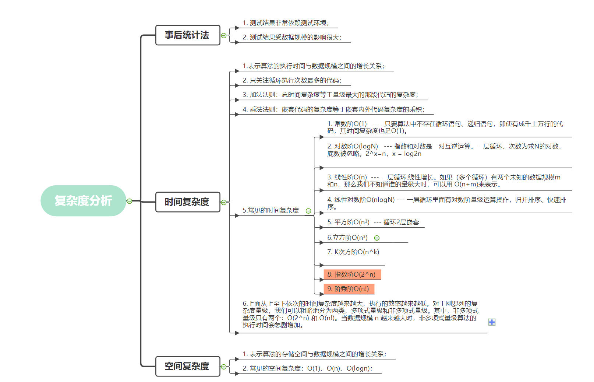

```json
{
  "date": "2020.10.27 22:00",
  "tags": ["数据结构","算法"]
}
```


我相信很多人都会有这种感觉，就是开发了一段时间的软件之后，就会发现我们使用的编程语言和框架会随着时间的变化而变得不在流行，或者不在实用。比如早些时候使用的jquery到后面的Vue和React,我也可以确认的是，在以后的某一天，当下流行的东西也会逐渐过时，现在webassembly越来越开始流行了，我还发现了使用Rust编写的WebAssembly运行时wasmer，意味着wasm可以运行在任何平台上，作为一种标准，这可能会改变软件的构建方式，也许有一天，wasmer就是一个OS系统，所有软件都是通过云端实时加载的，还记得Chromium OS 吗？说远了，其实我想说一切都在变，只有学习一些本质的技能，到什么时候都不会过时，比如数据结构和算法就是值得我们去学习的东西。


注：本系列学习的教程来自于极客时间王争老师的数据结构与算法之美，https://time.geekbang.org/column/intro/100017301。这里只是本人在学习过程中的理解和记录，方便自己查阅。


数据结构和算法其实就是怎样组织数据和怎样去操作这些数据，怎样更快和更省的解决问题，即如何让代码运行得更快，如何让代码更省存储空间。那怎么衡量你的算法执行效率呢？也就是怎么确定你的数据结构和算法的效果。

因此我们需要某种方法来评估程序的数据结构和算法效果， 关于复杂度可以分为如下两种：

- 时间复杂度（代码执行时间随数据规模增长的变化趋势）
- 空间复杂度（算法的存储空间随规模增长的增长趋势）

如果你写过 golang 性能测试的话，那么就会知道 go 有一个 ``` func Benchmarkxxx(b *testing.B)```可以用来统计一段程序在当前物理机上的平均执行时间和内存分配情况，那么这里的时间和内存分配情况与我们这里的 时间复杂度和空间复杂度是同一个东西吗？很显然并不是，虽然这种方式能比较准确的得出这段程序的执行时间和内存分配情况，不过它严重依赖当前物理机和数据的规模，我们需要一种通用的，甚至不需要运行代码就能知道它花费时间和空间的方式。它不涉及具体的测试数据，就可以粗略地估计算法的执行效率的方法，

# 时间复杂度

cup在执行代码的过程中，每一行代码执行的指令和时间虽然都不太相同，但是我们粗略估计每一行代码需要一个单位时间 (unitTime),    那么整段代码总的执行时间记为T(n)，我们来看看示例：

```go
func demo(n int) int {
	sum := 0
	i := 1
	for ; i <= n; i++ {
		sum = sum + i
	}
	return sum
}
```

根据前面的假设，我们代码的执行时间为```  T(n)= 执行的代码行数 * unitTime ``` ，这里的代码行数等于 2 + for循环体代码行数。 for循环体代码行数 = 2*n ,因此，这段代码 ``` T(n) =  (2 + 2 * n) * unitTime ``` , 现在我们可以发现一个规律，那就是代码的执行时间和代码行数成正比。

注意，时间复杂度是代码执行时间随数据规模（可以理解为代码行数）增长的变化趋势。

那么变化趋势怎么得到呢？上面的示例是代码的执行时间为 T(n) =   (2 + 2 * n)  *  unitTime ，因此这种变化趋势只跟n有关，而公式中的低阶、常量、系数三部分并不左右增长趋势，所以都可以忽略，这个道理和高数里面的极限是一样的，当n趋于无穷时，低阶项和常数可以忽略不计。同理，当n非常大的时候，低阶项和常数对结果的影响就十分小了，可以不用考虑它了，复杂度关心的是随着n的增加，计算规模的变化率。因此在这里n在变化率里面产生的效果更高，所以只需要关心n即可。那么我们可以使用 ``` T(n) = O(n)```公式来表示。公式中的 O，表示代码的执行时间 T(n) 与 f(n) 表达式成正比。

这就是大 O 时间复杂度表示法。大 O 时间复杂度实际上并不具体表示代码真正的执行时间，而是表示代码执行时间随数据规模增长的变化趋势，所以，也叫作渐进时间复杂度（asymptotic time complexity），简称时间复杂度。

再来看看两层循环的情况

```go
func dome(n int) {
	sum := 0
	i := 1
	j := 1
	for ; i <= n; i++ {
		j = 1
		for ; j <= n; j++ {
			sum = sum + i*j
		}
	}
}
```


其中，我们只关注循环执行次数最多的一段代码 ``` sum = sum + i*j``` 。那么他的复杂度为 T(n) = O(n²)

还有一种情况，当一段代码里面如果包含了O(n) 和 O(n²)的时候，我们一般取最大的量级 O(n²)。


1. 常数阶O(1)   ---  只要算法中不存在循环语句、递归语句，即使有成千上万行的代码，其时间复杂度也是Ο(1)。

2. 对数阶O(logN)   --- 指数和对数是一对互逆运算。一层循环，次数为求N的对数，底数被忽略。2^x=n，x = log2n

3. 线性阶O(n)  --- 一层循环,线性增长。如果（多个循环）有两个未知的数据规模m和n，那么我们不知道谁的量级大时，可以用 O(n+m)来表示。 

4. 线性对数阶O(nlogN) --- 一层循环里面有对数阶量级运算操作，归并排序、快速排序。

5. 平方阶O(n²)  --- 循环2层嵌套

6. 立方阶O(n³)

7. K次方阶O(n^k)

8. 指数阶O(2^n)

9. 阶乘阶O(n!)

上面从上至下依次的时间复杂度越来越大，执行的效率越来越低。对于刚罗列的复杂度量级，我们可以粗略地分为两类，多项式量级和非多项式量级。其中，非多项式量级只有两个：O(2^n) 和 O(n!)。当数据规模 n 越来越大时，非多项式量级算法的执行时间会急剧增加。

后续梳理常用算法的时候我们同时分析这些复杂度，这里有个印象即可。


这里补充一下对数阶O(logN)和线性对数阶O(nlogN)

```

 i=1;
 while (i <= n)  {
   i = i * 2;
 }
```

简化来说这里是时间复杂度就是```i = i * 2```的执行次数(时间)和n(数据规模)的增长的变化趋势，可以看出这里执行的就是如下的运算：

```
1*2
2*2
4*2
8*2

2^1、2^2、2^3、2^4、2^5
```

那么这里执行的次数2^x=n。因此想要知道执行次数可以使用 ```x=log2n```。也就得出这段代码的时间复杂度就是 O(log2N)。如果执```i = i * 3``` 那么就是O(log3N)，因此，像这类情况，可以统统视为对数阶O(logN)。那么线性对数阶就是在外部还有一层循环，也就是 对数阶O(logN)我们循环执行 n 遍记为O(nlogN)


# 空间复杂度

像时间复杂度一样，空间复杂度表示算法的存储空间与数据规模之间的增长关系。我们常见的空间复杂度就是 O(1)、O(n)、O(n2 )，像 O(logn)、O(nlogn) 这样的对数阶复杂度平时都用不到。


# 总结



https://mm.edrawsoft.cn/map.html?sharecode=5feaa07a476356a26855183

#### 参考资料：

https://zhuanlan.zhihu.com/p/50479555

https://time.geekbang.org/column/article/40036

